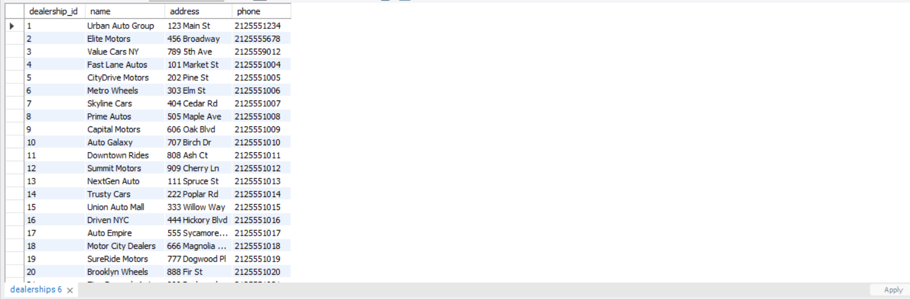
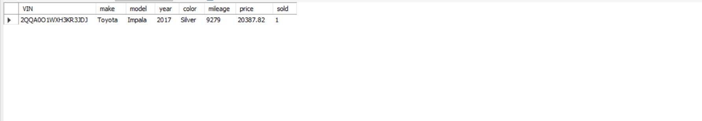
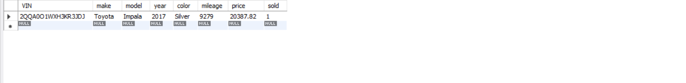
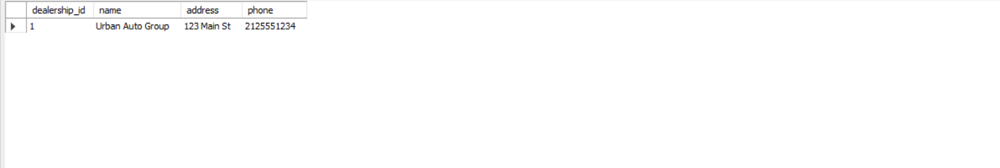
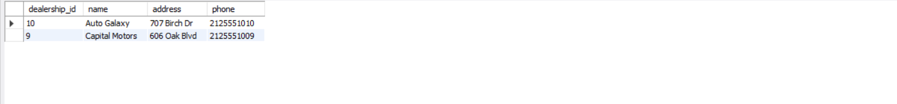
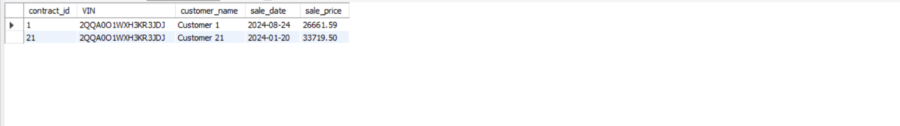

# 🚗 Dealership Database Queries

  

A comprehensive set of SQL queries for the **DealershipDatabase**. This documentation provides example queries to retrieve, filter, and analyze data. Each section includes the SQL code and a placeholder for a screenshot of the results.

---

## 📖 Table of Contents
## 1. [Get All Dealerships](#1-get-all-dealerships)

## 2. [Get Vehicles by Dealership](#2-get-vehicles-by-dealership)  

## 3. [Get Vehicle Details by VIN](#3-get-vehicle-details-by-vin)  

## 4. [Find Dealership by VIN](#4-find-dealership-by-vin) 

## 5. [Find Dealerships by Make/Model/Color](#5-find-dealerships-by-makemodelcolor)  

## 6. [Get Sales Contracts by Dealership and Date](#6-get-sales-contracts-by-dealership-and-date)


---

## 1️⃣ Get All Dealerships

Retrieve all records from the `dealerships` table.

```sql
SELECT *
FROM dealerships;
```

```sql
SELECT s.*
FROM sales_contracts s
JOIN inventory i ON s.VIN = i.VIN
WHERE i.dealership_id = 1
  AND s.sale_date BETWEEN '2023-01-01' AND '2025-12-31';
```
  


